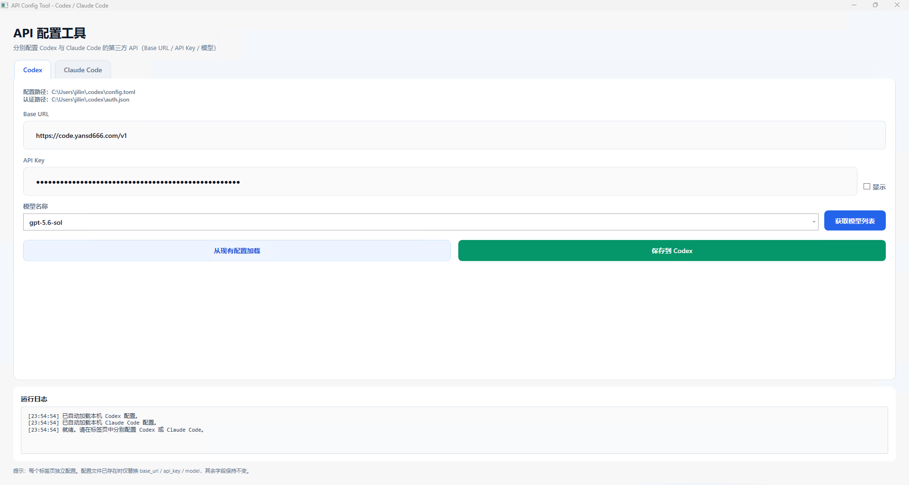

# API 配置工具（Codex / Claude Code）

用于配置 Codex 和 Claude Code 第三方 API 的小工具，支持：

- Windows 图形界面
- macOS / Linux 交互式终端脚本



## 功能

- 分别配置 Codex 和 Claude Code 的 Base URL、API Key 与模型名称
- 从兼容 OpenAI 的 `GET /v1/models` 接口获取模型列表
- 自动读取本机已有配置
- 配置存在时仅修改 API 地址、密钥和模型，保留其他字段
- 配置不存在时根据默认模板创建
- 自动规范化 API 地址

## Windows 使用方法

从 GitHub Release 下载以下任一文件：

- `ApiConfigTool-win-x64-v版本号.zip`：推荐下载，解压后运行
- `ApiConfigTool.exe`：可直接运行的单文件程序

双击 `ApiConfigTool.exe`，选择 Codex 或 Claude Code 标签页，填写配置后保存即可。

Windows 版本会修改以下文件：

- Codex
  - `%USERPROFILE%\.codex\config.toml`
  - `%USERPROFILE%\.codex\auth.json`
- Claude Code
  - `%USERPROFILE%\.claude\settings.json`

## macOS / Linux 使用方法

从 GitHub Release 下载 `api-config-tool.sh`，然后执行：

```sh
chmod +x api-config-tool.sh
./api-config-tool.sh
```

也可以直接进入指定配置流程：

```sh
./api-config-tool.sh --codex
./api-config-tool.sh --claude
```

终端脚本需要以下任一运行时：

- Python 3.8 或更高版本：自动获取模型列表并提供编号选择
- Node.js 16 或更高版本：没有 Python 时使用，模型名称改为手动输入

脚本更新已有配置前会创建带时间戳的备份，并支持以下环境变量：

- `CODEX_HOME`：自定义 Codex 配置目录，默认 `~/.codex`
- `CLAUDE_CONFIG_DIR`：自定义 Claude Code 配置目录，默认 `~/.claude`

macOS / Linux 版本会修改以下文件：

- Codex
  - `${CODEX_HOME:-~/.codex}/config.toml`
  - `${CODEX_HOME:-~/.codex}/auth.json`
- Claude Code
  - `${CLAUDE_CONFIG_DIR:-~/.claude}/settings.json`

## 本地构建

需要安装 .NET 9 SDK：

```powershell
dotnet restore
dotnet build -c Release
```

## 发布 Windows 单文件程序

```powershell
dotnet publish -c Release -r win-x64 --self-contained true `
  -p:PublishSingleFile=true `
  -p:IncludeNativeLibrariesForSelfExtract=true `
  -o publish
```

输出文件：`publish\ApiConfigTool.exe`

项目推送到 `main` 分支后，GitHub Actions 会自动递增补丁版本并创建 Release，同时发布 Windows 压缩包、Windows 单文件程序和 macOS / Linux 终端脚本。
